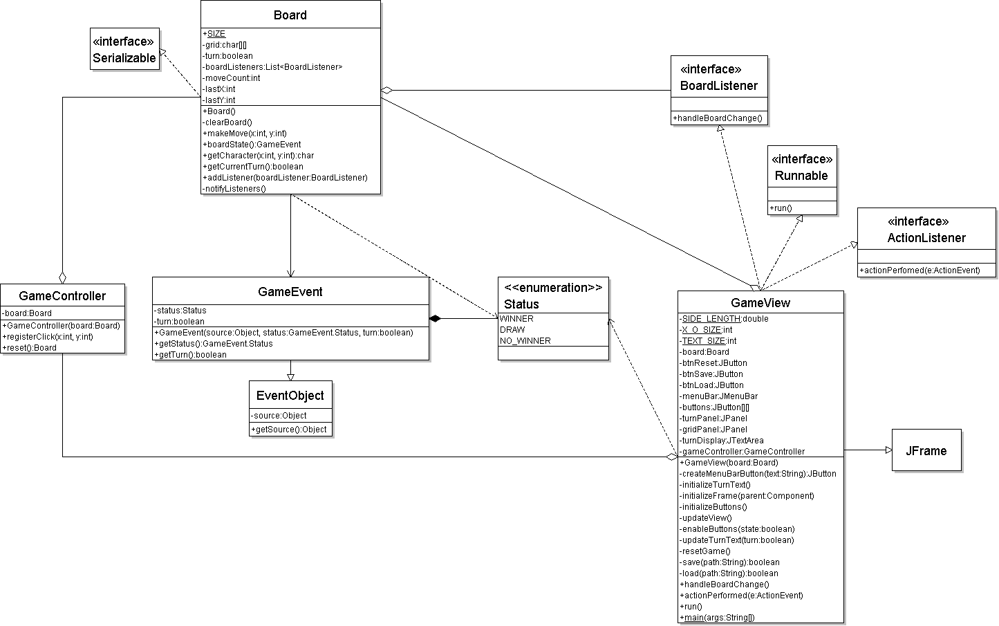

## Tic Tac Toe

A Java implementation of Tic Tac Toe in the MVC design pattern.

##### Getting Started

1. From your terminal, run:
   ```
   git clone https://github.com/john-breton/TicTacToeMVC
   ```
   This will create a folder called TicTacToeMVC.

2. IntelliJ IDEA
    1. Open the IntelliJ IDEA IDE, and click File -> Open.
    2. Select the TicTacToeMVC folder that was just created and click Open.

3. Eclipse
    1. Open the Eclipse IDE, and click File -> Import.
    2. Select Maven and then Existing Maven Projects, then click Next.
    3. Click Browse and select the TicTacToeMVC folder that was just created. Click Finish.

4. The entry point of the program is the main method of the GameView class under the view package.
5. The project can be built by invoking a `mvn package` command from the project's root directory. This will generate a
runnable jar file in the target directory.

### Class Diagram

<p style="text-align:right">

</p>
